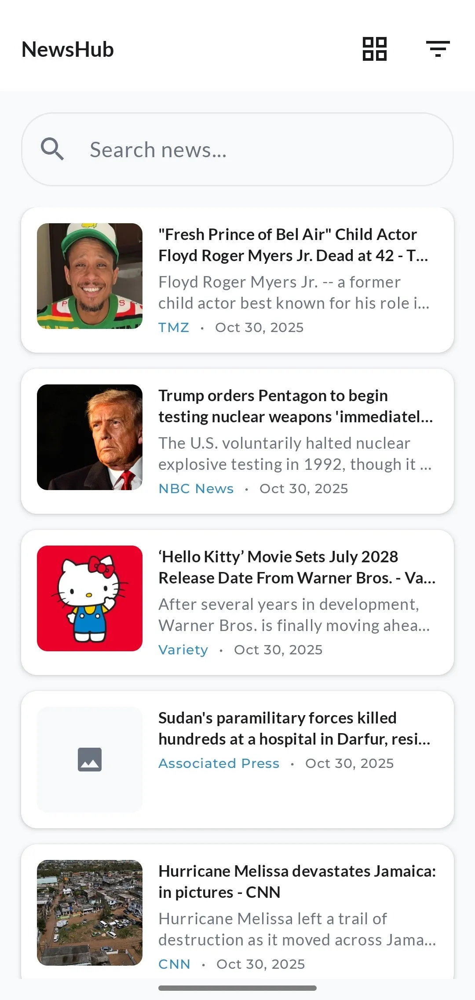
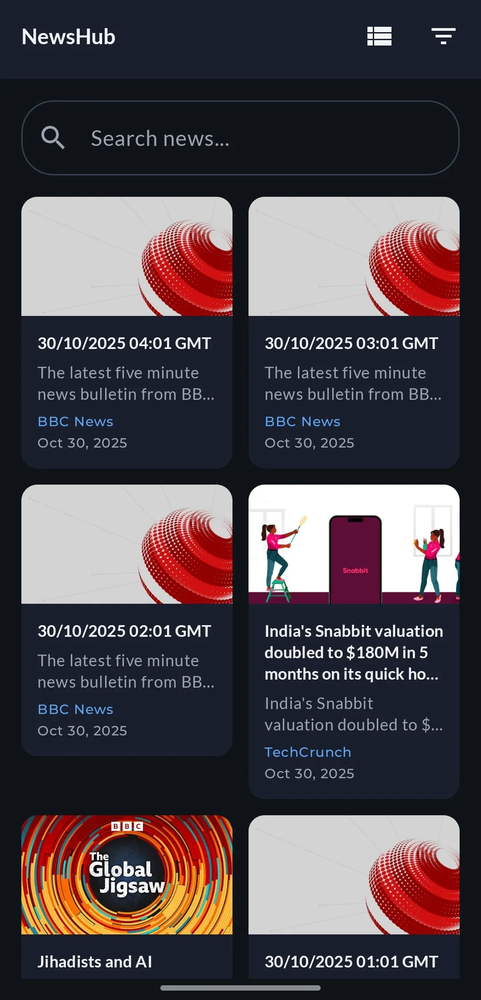

# NewsHub - Android News Reader

A modern Android news application built with Jetpack Compose that fetches and displays articles from
NewsAPI.org.

## 📥 Download APK

**The latest APK can be downloaded from
the [GitHub Actions tab](https://github.com/logickoder/newshub/actions):**

1. Navigate to the **Actions** tab in this repository
2. Click on the latest successful workflow run
3. Scroll down to **Artifacts**
4. Download the `newshub-apk` file

> **Note:** You may need to be logged into GitHub to download artifacts. Alternatively, check
> the [Releases](https://github.com/logickoder/newshub/releases) section for stable builds.

## 📊 Test Coverage

**Unit Test Coverage: 75%+** (on business logic layers)

Coverage is measured on:

- ✅ ViewModels (state management)
- ✅ Repository layer (data operations)
- ✅ Use Cases (business rules)
- ✅ Mappers (data transformations)

*Note: UI components (Compose screens), DTOs, and DI modules are excluded from coverage metrics as
they contain no business logic requiring unit tests.*

**View detailed coverage:**

1. Download `coverage-report` artifact from [Actions](https://github.com/logickoder/newshub/actions)
2. Open `index.html` in browser

## Features

- Browse news articles in List or Grid view
- View detailed article information
- Pull-to-refresh functionality
- Proper error handling and loading states
- Material 3 design
- Search functionality with debouncing
- Filter by category and article type
- Dark mode support

## Architecture

- **Pattern:** MVVM + Clean Architecture (Vertical Slice)
- **UI:** Jetpack Compose
- **DI:** Hilt
- **Networking:** Retrofit + OkHttp
- **Async:** Coroutines + Flow
- **Image Loading:** Coil

## Project Structure

```
app/
├── app/           # Application setup, DI modules
├── feed/          # News feed feature (presentation, domain, data)
├── details/       # Article details feature
```

## Setup Instructions

### Prerequisites

- Android Studio Hedgehog | 2023.1.1+
- JDK 17
- Android SDK 34

### Steps

1. Clone the repository

```bash
git clone https://github.com/logickoder/newshub.git
```

2. Get NewsAPI Key
    - Visit https://newsapi.org/
    - Register for a free API key
    - Add to `local.properties`:
   ```properties
   NEWS_API_KEY=your_api_key_here
   ```

3. Open project in Android Studio
4. Sync Gradle
5. Run the app

## Testing

Run unit tests:

```bash
./gradlew test
```

Run tests with coverage report:

```bash
./gradlew testDebugUnitTest jacocoTestReport
```

## API Reference

- **Base URL:** https://newsapi.org/v2/
- **Endpoints:**
    - `/top-headlines` - Fetch top news headlines
    - `/everything` - Search all articles
- **Parameters:** category, query, sortBy

## Dependencies

- **UI:** Jetpack Compose, Material 3
- **DI:** Hilt
- **Networking:** Retrofit, OkHttp
- **Image Loading:** Coil
- **Serialization:** Kotlinx Serialization
- **Async:** Coroutines, Flow
- **Testing:** JUnit, MockK, Turbine, Truth
- **Logging:** Napier

## Design Decisions

### Why MVVM + Clean Architecture?

- Clear separation of concerns
- Testable business logic
- Scalable and maintainable
- Easy to add new features without affecting existing code

### Why Vertical Slice Architecture?

- Features are self-contained (feed, details)
- Reduces coupling between features
- Makes the codebase easier to navigate
- Aligns with modern Android development practices

### Why Jetpack Compose?

- Modern declarative UI
- Required by the role
- Less boilerplate than XML
- Better performance and developer experience

### Why Hilt over Koin?

- Better compile-time safety
- Official Android recommendation
- Better IDE support
- Generates less runtime overhead

## CI/CD

This project uses GitHub Actions for continuous integration:

- ✅ Automated builds on push/pull request
- ✅ Unit test execution
- ✅ APK artifact generation
- ✅ Code quality checks

## Future Improvements

- Offline caching with Room
- Pagination for infinite scroll
- Bookmark/favorite articles
- Share article functionality
- Search history
- Article categories with chips
- Settings screen (theme, language, etc.)

## Screenshots

| Feed - Light Mode                                        | Feed - Dark Mode                                         |
|----------------------------------------------------------|----------------------------------------------------------|
|  |  |

| Details - Light Mode                                     | Details - Dark Mode                                      |
|----------------------------------------------------------|----------------------------------------------------------|
|  |  |

## Author

**Jeffery Orazulike**

- GitHub: [@logickoder](https://github.com/logickoder)
- LinkedIn: [Jeffery Orazulike](https://linkedin.com/in/logickoder)
- Website: [logickoder.dev](https://logickoder.dev)
- Email: jeffery@logickoder.dev

## Acknowledgments

- NewsAPI.org for providing the news data
- Android community for excellent libraries and resources

## License

This project is for assessment purposes.

---

**Built with ❤️ using Kotlin and Jetpack Compose**